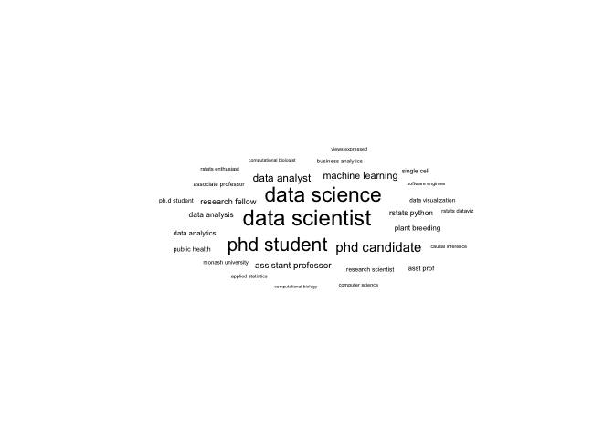

<!-- README.md is generated from README.Rmd. Please edit that file -->

# engagement-analytics

<!-- badges: start -->

<!-- badges: end -->

This repo contains twitter engagement data from my account
<a href="https://twitter.com/statsgen">@statsgen</a>. The data is
licensed under [CC
BY‑NC‑ND](https://creativecommons.org/licenses/by-nc-nd/2.0/au/).

The purpose of the repo is to contain evidence for my engagement
activities. If you are using the data not intended for this purpose, I’d
appreciate it if you let me know although it is not necessarily.

The code below shows how the data are read and analysed. The output
metrics are also shown below.

``` r
library(tidyverse)
library(lubridate)
df <- map_dfr(fs::dir_ls("twitter"), read_csv) %>% 
  mutate(time = str_replace(time, " [+]0000", ""),
         time = ymd_hm(time))

impress <- sum(df$impressions)
engage <- sum(df$engagements)
min_time <- min(df$time)
max_time <- max(df$time)
```

The data contains tweet from the beginning of **April 2020** to the end
of **March 2021**. During this period I have a total of **551,566
impressions** and a total of **37,846 engagements**.

``` r
ggplot(df, aes(time, impressions)) +
  geom_line() + 
  ggtitle("Impressions") +
  scale_y_log10() +
  geom_smooth()
```

<!-- -->

## Twitter followers

This shows what sort of followers I have.

``` r
library(rtweet)
followers <- get_followers("statsgen")
follower_df <- lookup_users(followers$user_id)
```

``` r
library(tidytext)
library(ggwordcloud)

profile_df <- follower_df %>% 
  select(description) %>% 
  unnest_tokens(word, description, token = "ngrams", n = 2)  %>% 
  filter(!is.na(word)) %>% 
  separate(word, c("word1", "word2"), sep = " ") %>% 
  filter(!word1 %in%  c(stop_words$word, "https", "de"),
         !word2 %in%  stop_words$word) %>%
  mutate(word = paste(word1, word2)) %>% 
  select(word) %>% 
  count(word, sort = TRUE)
```

``` r
set.seed(1)
ggplot(filter(profile_df, n > 10), 
       aes(label = word, size = n)) +
  geom_text_wordcloud_area(area_corr_power = 1) + 
  scale_size_area(max_size = 20) +
  theme_minimal()
```

<!-- -->

``` r
profile_df %>% 
  slice(1:20) %>% 
  knitr::kable()
```

| word                    |   n |
| :---------------------- | --: |
| data scientist          | 180 |
| data science            | 151 |
| phd student             | 122 |
| phd candidate           |  76 |
| machine learning        |  45 |
| assistant professor     |  44 |
| data analyst            |  40 |
| research fellow         |  29 |
| data analysis           |  22 |
| plant breeding          |  22 |
| rstats python           |  21 |
| associate professor     |  19 |
| data analytics          |  19 |
| research scientist      |  18 |
| data visualization      |  17 |
| business analytics      |  16 |
| public health           |  16 |
| monash university       |  15 |
| computational biologist |  14 |
| ph.d student            |  13 |
